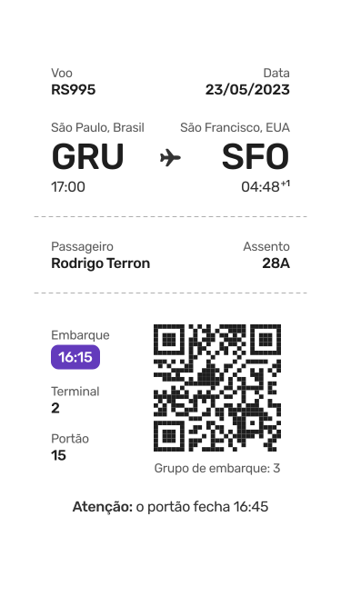

<h1 align="center">
    
</h1>

<h4 align="center"> 
	:heavy_check_mark: 🚀 Cartão de Embarque - Bora codar 🚀 :heavy_check_mark:
</h4>

  <a href="#-projeto">Projeto</a>&nbsp;&nbsp;&nbsp;|&nbsp;&nbsp;&nbsp;
  <a href="#-como-executar">Como executar</a>&nbsp;&nbsp;&nbsp;|&nbsp;&nbsp;&nbsp;
  <a href="#-tecnologias">Tecnologias</a>&nbsp;&nbsp;&nbsp;|&nbsp;&nbsp;&nbsp;
  <a href="#memo-licença">Licença</a>

<a target="_blank" href="https://bora-codar-five.vercel.app">Demo</a>

## 🈸 Projeto

Desafio de modelagem de um cartão de embarque.

## 🔧 Como Executar
Navegue até a pasta onde clonou o projeto e execute os seguintes comandos no terminal:

01 - npm install (Esse comando irá instalar todas as dependências do projeto)

02 - cd client

03 - npm run dev (Esse comando irá executar o projeto e por default estará rodando em: http://localhost:3000 caso nenhuma outra aplicação esteja rodando na porta

## 🚀 Tecnologias

O projeto foi desenvolvido utilizando as seguintes tecnologias:

- [React](https://reactjs.org)
- [Vite](https://vitejs.dev)
- [Typescript](https://www.typescriptlang.org)
- [Styled-components](https://styled-components.com)

## :memo: Licença
Este projeto está sob a licença do MIT. Consulte a [LICENÇA](LICENSE) para obter detalhes.
